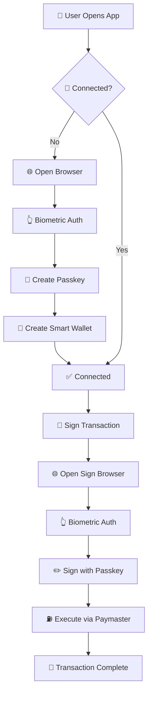

<div align="center">
  
# 🛡️ LazorKit Wallet Mobile Adapter

<p align="center">
  
  
  
  
</p>

<p align="center">
  
  
  
  
</p>

**A powerful React Native SDK for integrating LazorKit smart wallets with WebAuthn passkey authentication.**

*Secure, gasless wallet functionality for mobile applications with zero seed phrase management.*

</div>

---

## ✨ Features

<table>
<tr>
<td>

### 🔐 **WebAuthn Authentication**
Secure biometric authentication using Face ID, Touch ID, and fingerprint sensors

</td>
<td>

### 🎯 **Smart Contract Wallets**
Account abstraction on Solana with enhanced security and programmable rules

</td>
</tr>
<tr>
<td>

### ⛽ **Gasless Transactions**
Fee sponsorship through integrated paymaster service - no SOL required

</td>
<td>

### 📱 **Mobile-First Design**
Optimized for React Native and Expo with seamless UX

</td>
</tr>
<tr>
<td>

### 🔄 **Auto-Persistence**
Automatic wallet state management with AsyncStorage integration

</td>
<td>

### 🛡️ **Type Safe**
Complete TypeScript support with comprehensive error handling

</td>
</tr>
<tr>
<td>

### 🐛 **Debug Mode**
Configurable logging for development and production environments

</td>
<td>

### ⚡ **Performance**
Lightweight SDK with minimal bundle size and optimized operations

</td>
</tr>
</table>

---

## 🚀 Quick Start

### 📦 Installation

```bash
# Install the main package
npm install @lazorkit/wallet-mobile-adapter

# Install required dependencies
npm install @coral-xyz/anchor @react-native-async-storage/async-storage \
            react-native-get-random-values expo-web-browser buffer js-sha256 bs58
```

<details>
<summary>📱 Platform Setup</summary>

#### iOS Setup
```bash
cd ios && pod install
```

#### Android Setup
No additional setup required.

</details>

### ⚡ Basic Implementation

<details>
<summary>🔧 Complete Setup Example</summary>

```tsx
import React from 'react';
import { LazorKitWalletProvider, useLazorWallet } from '@lazorkit/wallet-mobile-adapter';
import { View, Button, Text, StyleSheet } from 'react-native';
import * as anchor from '@coral-xyz/anchor';

// 🏗️ 1. Setup Provider
export default function App() {
  return (
    <LazorKitWalletProvider
      rpcUrl="https://api.devnet.solana.com"
      ipfsUrl="https://portal.lazor.sh"
      paymasterUrl="https://lazorkit-paymaster.onrender.com"
      isDebug={true} // Enable debug logging in development
    >
      <WalletScreen />
    </LazorKitWalletProvider>
  );
}

// 🎯 2. Use Wallet Hook
function WalletScreen() {
  const {
    smartWalletPubkey,
    isConnected,
    isConnecting,
    isSigning,
    isLoading,
    error,
    connect,
    disconnect,
    signMessage,
  } = useLazorWallet();

  const handleConnect = async () => {
    try {
      const wallet = await connect({
        redirectUrl: 'yourapp://wallet',
        onSuccess: (wallet) => console.log('✅ Connected:', wallet.smartWallet),
        onFail: (error) => console.error('❌ Connection failed:', error.message),
      });
      console.log('🎉 Wallet connected:', wallet);
    } catch (error) {
      console.error('💥 Connect error:', error);
    }
  };

  const handleTransaction = async () => {
    if (!smartWalletPubkey) return;

    const instruction = anchor.web3.SystemProgram.transfer({
      fromPubkey: smartWalletPubkey,
      toPubkey: new anchor.web3.PublicKey('11111111111111111111111111111111'),
      lamports: 1000000, // 0.001 SOL
    });

    try {
      const signature = await signMessage(instruction, {
        redirectUrl: 'yourapp://sign',
        onSuccess: (signature) => console.log('✅ Transaction sent:', signature),
        onFail: (error) => console.error('❌ Transaction failed:', error.message),
      });
      console.log('🎉 Transaction signature:', signature);
    } catch (error) {
      console.error('💥 Sign error:', error);
    }
  };

  const handleDisconnect = async () => {
    try {
      await disconnect({
        onSuccess: () => console.log('✅ Disconnected successfully'),
        onFail: (error) => console.error('❌ Disconnect failed:', error.message),
      });
    } catch (error) {
      console.error('💥 Disconnect error:', error);
    }
  };

  return (
    <View style={styles.container}>
      {error && (
        <View style={styles.errorContainer}>
          <Text style={styles.errorText}>❌ Error: {error.message}</Text>
        </View>
      )}
      
      {!isConnected ? (
        <Button 
          title={isConnecting ? "🔄 Connecting..." : "🔐 Connect Wallet"} 
          onPress={handleConnect}
          disabled={isConnecting}
        />
      ) : (
        <View style={styles.connectedContainer}>
          <Text style={styles.walletText}>
            🏦 Wallet: {smartWalletPubkey?.toString()}
          </Text>
          <Button 
            title={isSigning ? "✏️ Signing..." : "💸 Send Transaction"} 
            onPress={handleTransaction} 
            disabled={isSigning || isLoading}
          />
          <Button title="🚪 Disconnect" onPress={handleDisconnect} />
        </View>
      )}
    </View>
  );
}

const styles = StyleSheet.create({
  container: { padding: 20 },
  errorContainer: { 
    backgroundColor: '#ffebee', 
    padding: 10, 
    borderRadius: 5, 
    marginBottom: 10 
  },
  errorText: { color: '#c62828' },
  connectedContainer: { gap: 10 },
  walletText: { fontSize: 12, fontFamily: 'monospace' },
});
```

</details>

---

## 📋 Core Concepts

<div align="center">

### 🔄 WebAuthn Flow



</div>

### 🎯 Smart Wallets
- **🏗️ Account Abstraction**: Smart contract wallets with programmable security rules
- **🔑 Passkey Control**: Controlled by device-secure WebAuthn passkeys, not private keys
- **🚫 No Seed Phrases**: Enhanced UX without traditional wallet complexity

### 🔐 WebAuthn Flow
1. **🔗 Connect**: Creates passkey with biometric authentication via browser
2. **✏️ Sign**: Uses passkey to authorize transactions through browser signing
3. **⚡ Execute**: Smart wallet executes on-chain via paymaster fee sponsorship

### ⛽ Gasless Experience
- **💰 Fee Sponsorship**: Paymaster covers all transaction fees
- **🆓 Zero SOL Required**: Users transact without needing SOL
- **✨ Seamless UX**: No gas management complexity

---

## ⚙️ Configuration

### 🏗️ Provider Props

<table>
<tr>
<th>Prop</th>
<th>Type</th>
<th>Default</th>
<th>Description</th>
</tr>
<tr>
<td><code>rpcUrl</code></td>
<td><code>string?</code></td>
<td><code>devnet</code></td>
<td>🌐 Solana RPC endpoint</td>
</tr>
<tr>
<td><code>ipfsUrl</code></td>
<td><code>string?</code></td>
<td><code>portal.lazor.sh</code></td>
<td>🏠 LazorKit portal URL</td>
</tr>
<tr>
<td><code>paymasterUrl</code></td>
<td><code>string?</code></td>
<td><code>paymaster URL</code></td>
<td>⛽ Fee sponsorship service</td>
</tr>
<tr>
<td><code>isDebug</code></td>
<td><code>boolean?</code></td>
<td><code>false</code></td>
<td>🐛 Enable debug logging</td>
</tr>
</table>

### 🐛 Debug Mode

<details>
<summary>📊 Logging Configuration</summary>

```tsx
// 🛠️ Development - Full logging
<LazorKitWalletProvider isDebug={true}>
  <App />
</LazorKitWalletProvider>

// 🏭 Production - Errors and warnings only
<LazorKitWalletProvider isDebug={false}>
  <App />
</LazorKitWalletProvider>
```

**Debug Mode Shows:**
- ✅ Connection establishment logs
- 📝 Transaction signing flows  
- ❌ Error details with context
- 💾 Storage operations
- 🌐 Browser interactions

</details>

### 🔗 Deep Link Setup

<details>
<summary>📱 iOS Configuration</summary>

**Info.plist:**
```xml
<key>CFBundleURLTypes</key>
<array>
  <dict>
    <key>CFBundleURLSchemes</key>
    <array><string>yourapp</string></array>
  </dict>
</array>
```

</details>

<details>
<summary>🤖 Android Configuration</summary>

**AndroidManifest.xml:**
```xml
<activity android:name=".MainActivity" android:launchMode="singleTask">
  <intent-filter>
    <action android:name="android.intent.action.VIEW" />
    <category android:name="android.intent.category.DEFAULT" />
    <category android:name="android.intent.category.BROWSABLE" />
    <data android:scheme="yourapp" />
  </intent-filter>
</activity>
```

</details>

---

## 🔧 Advanced Usage

### 🚨 Error Handling

<details>
<summary>💎 Professional Error Management</summary>

```tsx
import { 
  LazorKitError, 
  WalletConnectionError, 
  SigningError 
} from '@lazorkit/wallet-mobile-adapter';

try {
  await connect({ redirectUrl: 'yourapp://callback' });
} catch (error) {
  if (error instanceof WalletConnectionError) {
    console.error('🔗 Connection failed:', error.message);
  } else if (error instanceof SigningError) {
    console.error('✏️ Signing failed:', error.message);
  } else if (error instanceof LazorKitError) {
    console.error('⚡ LazorKit error:', error.message, error.code);
  } else {
    console.error('❓ Unknown error:', error);
  }
}
```

</details>

### 🏪 Direct Store Access

<details>
<summary>🔬 Advanced State Management</summary>

```tsx
import { useWalletStore } from '@lazorkit/wallet-mobile-adapter';

function AdvancedComponent() {
  const {
    wallet,
    config,
    connection,
    setConfig,
    setError,
    clearError,
  } = useWalletStore();

  const updateConfig = () => {
    setConfig({
      ipfsUrl: 'https://new-portal.lazor.sh',
      paymasterUrl: 'https://new-paymaster.com',
      rpcUrl: 'https://api.mainnet-beta.solana.com',
    });
  };

  return (
    <View>
      <Text>⚙️ Config: {JSON.stringify(config, null, 2)}</Text>
      <Button title="🔄 Update Config" onPress={updateConfig} />
    </View>
  );
}
```

</details>

### 🛠️ Utility Functions

<details>
<summary>🔧 Custom Implementation Helpers</summary>

```tsx
import { 
  logger,
  handleAuthRedirect,
  handleBrowserResult,
  getFeePayer,
  createWalletActions,
} from '@lazorkit/wallet-mobile-adapter';

// 🔍 Custom authentication handling
const walletInfo = handleAuthRedirect(redirectUrl);
if (walletInfo) {
  console.log('📋 Parsed wallet info:', walletInfo);
}

// ✏️ Custom signing result handling
try {
  const browserResult = handleBrowserResult(signResultUrl);
  console.log('📝 Signature data:', browserResult);
} catch (error) {
  logger.error('❌ Failed to parse browser result:', error);
}

// 💰 Get paymaster fee payer
try {
  const feePayer = await getFeePayer('https://your-paymaster.com');
  console.log('💳 Fee payer:', feePayer.toString());
} catch (error) {
  logger.error('❌ Failed to get fee payer:', error);
}
```

</details>

---

## 📚 API Reference

### 🎣 Hook Interface

<details>
<summary>📖 Complete Hook Documentation</summary>

```typescript
interface LazorWalletHook {
  // 📊 State
  smartWalletPubkey: anchor.web3.PublicKey | null;
  isConnected: boolean;
  isLoading: boolean;
  isConnecting: boolean;
  isSigning: boolean;
  error: Error | null;
  connection: anchor.web3.Connection;
  
  // 🎬 Actions  
  connect: (options: ConnectOptions) => Promise<WalletInfo>;
  disconnect: (options?: DisconnectOptions) => Promise<void>;
  signMessage: (
    instruction: anchor.web3.TransactionInstruction, 
    options: SignOptions
  ) => Promise<string>;
}
```

</details>

### 📝 Core Types

<details>
<summary>🔍 TypeScript Definitions</summary>

```typescript
interface WalletInfo {
  readonly credentialId: string;
  readonly passkeyPubkey: number[];
  readonly expo: string;
  readonly platform: string;
  readonly smartWallet: string;
  readonly smartWalletAuthenticator: string;
}

interface WalletConfig {
  readonly ipfsUrl: string;
  readonly paymasterUrl: string;
  readonly rpcUrl?: string;
}

interface ConnectOptions {
  readonly redirectUrl: string;
  readonly onSuccess?: (wallet: WalletInfo) => void;
  readonly onFail?: (error: Error) => void;
}

interface SignOptions {
  readonly redirectUrl: string;
  readonly onSuccess?: (signature: string) => void;
  readonly onFail?: (error: Error) => void;
}
```

</details>

### 🚨 Error Classes

<details>
<summary>⚡ Error Handling Types</summary>

```typescript
class LazorKitError extends Error {
  constructor(message: string, public code?: string);
}

class WalletConnectionError extends LazorKitError {
  constructor(message: string);
}

class SigningError extends LazorKitError {
  constructor(message: string);
}
```

</details>

---

## 🏗️ Architecture

<div align="center">

### 📁 Project Structure

```
src/
├── 📄 index.ts              ← Main exports
├── 📋 types.ts              ← TypeScript definitions  
├── ⚙️ config.ts             ← Configuration constants
├── 🛠️ utils.ts              ← Utility functions & logger
├── 🏪 wallet-store.ts       ← Zustand state management
├── 🏗️ wallet-provider.tsx   ← React provider component
├── 🎣 hook.ts               ← React hook
├── 🎬 actions.ts            ← Store action functions
└── ⚓ anchor/               ← Solana program interfaces
    ├── 📌 constants.ts      ← Program constants
    ├── 🔧 utils.ts          ← Anchor utilities
    ├── 🔌 interface/        ← Program interfaces
    ├── 📝 types/            ← Generated types
    └── 📋 idl/              ← Program IDLs
```

</div>

### 🎯 Design Principles

<table>
<tr>
<td align="center">

### 🎯 Single Responsibility
Each module has a clear, focused purpose

</td>
<td align="center">

### 🔧 Separation of Concerns
UI, state, and business logic are separated

</td>
</tr>
<tr>
<td align="center">

### 📝 Comprehensive Logging
Detailed error tracking and debugging

</td>
<td align="center">

### 🛡️ Type Safety
Complete TypeScript coverage

</td>
</tr>
<tr>
<td align="center">

### ⚡ Performance
Optimized for mobile with minimal bundle size

</td>
<td align="center">

### 🧪 Testable
Clean architecture enables easy testing

</td>
</tr>
</table>

---

## 🔒 Security

<div align="center">

| 🛡️ Security Feature | 📋 Description |
|:---:|:---|
| 🔐 **Hardware Security** | Passkeys stored in device secure enclave |
| 🚫 **No Private Keys** | No sensitive material in app storage |
| 🌐 **WebAuthn Standard** | Industry-standard authentication protocol |
| 🔒 **HTTPS Only** | All network communications encrypted |
| 🛡️ **Error Isolation** | Comprehensive error handling prevents data leaks |

</div>

---

## 📱 Platform Support

<div align="center">

<table>
<tr>
<th>📱 Platform</th>
<th>📋 Requirements</th>
<th>🔐 Authentication</th>
</tr>
<tr>
<td><strong>🍎 iOS</strong></td>
<td>14+ required</td>
<td>Face ID / Touch ID</td>
</tr>
<tr>
<td><strong>🤖 Android</strong></td>
<td>7+ required</td>
<td>Biometric / Fingerprint</td>
</tr>
<tr>
<td><strong>⚛️ React Native</strong></td>
<td>0.60+ supported</td>
<td>Platform native</td>
</tr>
<tr>
<td><strong>🔄 Expo</strong></td>
<td>SDK 45+ managed</td>
<td>Full support</td>
</tr>
</table>

</div>

---

## 🐛 Troubleshooting

### 🚨 Common Issues

<details>
<summary>💾 AsyncStorage Error</summary>

```bash
npm install @react-native-async-storage/async-storage
cd ios && pod install  # iOS only
```

</details>

<details>
<summary>🔧 Buffer/Crypto Polyfills</summary>

```tsx
// Add to your index.js or App.tsx
import 'react-native-get-random-values';
import { Buffer } from 'buffer';
global.Buffer = Buffer;
```

</details>

### 🔍 Debug Mode

<details>
<summary>📊 Enable Detailed Logging</summary>

```tsx
<LazorKitWalletProvider isDebug={true}>
  <App />
</LazorKitWalletProvider>
```

**Shows:**
- ✅ Connection establishment logs
- 📝 Transaction signing flows  
- ❌ Error details with context
- 💾 Storage operations
- 🌐 Browser interactions

</details>

### 💾 Storage Debugging

<details>
<summary>🔍 Inspect AsyncStorage Data</summary>

```tsx
import AsyncStorage from '@react-native-async-storage/async-storage';

// 👀 View stored wallet data
const checkStorage = async () => {
  try {
    const data = await AsyncStorage.getItem('lazor-wallet-store');
    console.log('📊 Stored data:', JSON.parse(data || '{}'));
  } catch (error) {
    console.error('❌ Storage error:', error);
  }
};

// 🗑️ Clear all data (development only)
const clearStorage = async () => {
  await AsyncStorage.removeItem('lazor-wallet-store');
};
```

</details>

---

## 🧪 Complete Example

<details>
<summary>🚀 Production-Ready Demo App</summary>

```tsx
import React, { useEffect } from 'react';
import { 
  View, 
  Text, 
  Button, 
  StyleSheet, 
  Alert,
  ScrollView 
} from 'react-native';
import { 
  LazorKitWalletProvider, 
  useLazorWallet,
  logger 
} from '@lazorkit/wallet-mobile-adapter';
import * as anchor from '@coral-xyz/anchor';

export default function App() {
  return (
    <LazorKitWalletProvider
      rpcUrl="https://api.devnet.solana.com"
      ipfsUrl="https://portal.lazor.sh" 
      paymasterUrl="https://lazorkit-paymaster.onrender.com"
      isDebug={true}
    >
      <WalletDemo />
    </LazorKitWalletProvider>
  );
}

function WalletDemo() {
  const wallet = useLazorWallet();

  useEffect(() => {
    if (wallet.error) {
      Alert.alert('❌ Wallet Error', wallet.error.message);
    }
  }, [wallet.error]);

  const sendTestTransaction = async () => {
    if (!wallet.smartWalletPubkey) return;

    const instruction = anchor.web3.SystemProgram.transfer({
      fromPubkey: wallet.smartWalletPubkey,
      toPubkey: new anchor.web3.PublicKey('11111111111111111111111111111111'),
      lamports: anchor.web3.LAMPORTS_PER_SOL * 0.001, // 0.001 SOL
    });

    try {
      const signature = await wallet.signMessage(instruction, {
        redirectUrl: 'myapp://transaction',
        onSuccess: (sig) => {
          Alert.alert('✅ Success', `Transaction sent: ${sig}`);
        },
        onFail: (error) => {
          Alert.alert('❌ Transaction Failed', error.message);
        },
      });
    } catch (error) {
      logger.error('💥 Transaction error:', error);
    }
  };

  return (
    <ScrollView style={styles.container}>
      <Text style={styles.title}>🛡️ LazorKit Wallet Demo</Text>
      
      <View style={styles.section}>
        <Text style={styles.sectionTitle}>📊 Wallet Status</Text>
        <Text>🔗 Connected: {wallet.isConnected ? '✅ Yes' : '❌ No'}</Text>
        <Text>⏳ Loading: {wallet.isLoading ? '🔄 Yes' : '✅ No'}</Text>
        <Text>🔌 Connecting: {wallet.isConnecting ? '🔄 Yes' : '✅ No'}</Text>
        <Text>✏️ Signing: {wallet.isSigning ? '🔄 Yes' : '✅ No'}</Text>
        
        {wallet.smartWalletPubkey && (
          <Text style={styles.address}>
            🏦 Address: {wallet.smartWalletPubkey.toString()}
          </Text>
        )}
      </View>

      <View style={styles.section}>
        <Text style={styles.sectionTitle}>🎬 Actions</Text>
        
        {!wallet.isConnected ? (
          <Button
            title={wallet.isConnecting ? "🔄 Connecting..." : "🔐 Connect Wallet"}
            onPress={() => wallet.connect({
              redirectUrl: 'myapp://connect',
              onSuccess: (w) => Alert.alert('🎉 Connected!', `Wallet: ${w.smartWallet}`),
              onFail: (e) => Alert.alert('❌ Connection Failed', e.message),
            })}
            disabled={wallet.isConnecting}
          />
        ) : (
          <>
            <Button
              title={wallet.isSigning ? "✏️ Signing..." : "💸 Send Test Transaction"}
              onPress={sendTestTransaction}
              disabled={wallet.isSigning || wallet.isLoading}
            />
            <View style={styles.spacer} />
            <Button
              title="🚪 Disconnect"
              onPress={() => wallet.disconnect({
                onSuccess: () => Alert.alert('✅ Disconnected', 'Wallet disconnected successfully'),
                onFail: (e) => Alert.alert('❌ Disconnect Failed', e.message),
              })}
              color="red"
            />
          </>
        )}
      </View>
    </ScrollView>
  );
}

const styles = StyleSheet.create({
  container: {
    flex: 1,
    padding: 20,
    backgroundColor: '#f5f5f5',
  },
  title: {
    fontSize: 24,
    fontWeight: 'bold',
    textAlign: 'center',
    marginBottom: 30,
  },
  section: {
    backgroundColor: 'white',
    padding: 15,
    borderRadius: 10,
    marginBottom: 20,
    shadowColor: '#000',
    shadowOffset: { width: 0, height: 2 },
    shadowOpacity: 0.1,
    shadowRadius: 4,
    elevation: 3,
  },
  sectionTitle: {
    fontSize: 18,
    fontWeight: '600',
    marginBottom: 10,
  },
  address: {
    fontSize: 12,
    fontFamily: 'monospace',
    backgroundColor: '#f0f0f0',
    padding: 10,
    borderRadius: 5,
    marginTop: 10,
  },
  spacer: {
    height: 10,
  },
});
```

</details>

---

<div align="center">

## 📄 License

**MIT License** - see [LICENSE](LICENSE) file for details.

## 🤝 Support & Community

<p>
  <a href="https://docs.lazorkit.com">
    
  </a>
  <a href="https://github.com/lazorkit/wallet-mobile-adapter/issues">
    
  </a>
</p>

---

<p align="center">
  <strong>Built with ❤️ by the LazorKit team</strong>
</p>

<p align="center">
  
</p>

</div>
