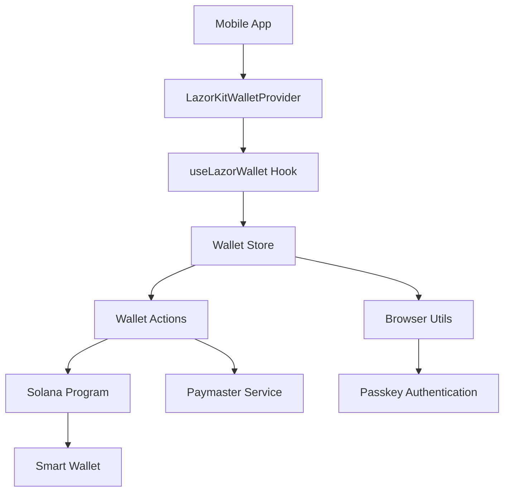

# 🚀 lazorkit - Mobile Wallet Adapter

<div align="center">
  
  
  
  
</div>

<br />

> **The future of mobile crypto is here.** Experience seamless, passwordless authentication with cutting-edge passkey technology, smart wallets, and gasless transactions - all in one React Native package.

## ✨ What Makes This Special?

🔐 **Passwordless Authentication** - No more managing private keys! Use your device's biometric authentication  
💸 **Gasless Transactions** - Built-in paymaster support for frictionless user experience  
📱 **Native Mobile First** - Designed specifically for React Native with Expo support  
⚡ **Smart Wallet Integration** - Automatic smart wallet creation and management  
🔗 **Web3 Ready** - Full Solana integration with Anchor framework support  

---

## 🎯 Quick Start

### Installation

```bash
# Using npm
npm install @lazorkit/wallet-mobile-adapter

# Using yarn
yarn add @lazorkit/wallet-mobile-adapter

# Peer dependencies
yarn add expo-web-browser @coral-xyz/anchor
```

### Basic Setup

**1. Wrap your app with the provider:**

```tsx
import React from 'react';
import { LazorKitWalletProvider } from '@lazorkit/wallet-mobile-adapter';

export default function App() {
  return (
    <LazorKitWalletProvider
      rpcUrl="https://api.devnet.solana.com"
      ipfsUrl="https://portal.lazor.sh"
      paymasterUrl="https://lazorkit-paymaster.onrender.com"
    >
      <YourApp />
    </LazorKitWalletProvider>
  );
}
```

**2. Connect and interact with the wallet:**

```tsx
import React from 'react';
import { View, Button, Text, StyleSheet } from 'react-native';
import { useLazorWallet } from '@lazorkit/wallet-mobile-adapter';
import * as anchor from '@coral-xyz/anchor';

export function WalletExample() {
  const {
    smartWalletPubkey,
    isConnected,
    isConnecting,
    isSigning,
    error,
    connect,
    disconnect,
    signMessage,
  } = useLazorWallet();

  const handleConnect = () => {
    connect({
      redirectUrl: 'exp://localhost:8081',
      onSuccess: (wallet) => {
        console.log('🎉 Wallet connected!', wallet.smartWallet);
      },
      onFail: (error) => {
        console.error('❌ Connection failed:', error.message);
      },
    });
  };

  const handleSign = () => {
    // Create a simple memo instruction
    const memoInstruction = new anchor.web3.TransactionInstruction({
      keys: [],
      programId: new anchor.web3.PublicKey('Memo1UhkJRfHyvLMcVucJwxXeuD728EqVDDwQDxFMNo'),
      data: Buffer.from('Hello from lazorkit! 🚀', 'utf-8'),
    });

    signMessage(memoInstruction, {
      redirectUrl: 'exp://localhost:8081',
      onSuccess: (signature) => {
        console.log('✅ Transaction signed:', signature);
      },
      onFail: (error) => {
        console.error('❌ Signing failed:', error.message);
      },
    });
  };

  return (
    <View style={styles.container}>
      <Text style={styles.title}>lazorkit Wallet Demo</Text>
      
      {!isConnected ? (
        <View style={styles.connectSection}>
          <Text style={styles.subtitle}>Connect your wallet to get started</Text>
          <Button
            title={isConnecting ? '🔄 Connecting...' : '🔗 Connect Wallet'}
            onPress={handleConnect}
            disabled={isConnecting}
          />
        </View>
      ) : (
        <View style={styles.walletSection}>
          <Text style={styles.address}>
            📍 {smartWalletPubkey?.toBase58().slice(0, 8)}...
            {smartWalletPubkey?.toBase58().slice(-8)}
          </Text>
          
          <View style={styles.actions}>
            <Button
              title={isSigning ? '✍️ Signing...' : '✍️ Sign Message'}
              onPress={handleSign}
              disabled={isSigning}
            />
            <Button
              title="🚪 Disconnect"
              onPress={() => disconnect()}
              color="#ff6b6b"
            />
          </View>
        </View>
      )}

      {error && (
        <Text style={styles.error}>
          ⚠️ {error.message}
        </Text>
      )}
    </View>
  );
}

const styles = StyleSheet.create({
  container: {
    flex: 1,
    justifyContent: 'center',
    alignItems: 'center',
    padding: 20,
    backgroundColor: '#f8f9fa',
  },
  title: {
    fontSize: 24,
    fontWeight: 'bold',
    marginBottom: 20,
    color: '#333',
  },
  subtitle: {
    fontSize: 16,
    color: '#666',
    marginBottom: 20,
    textAlign: 'center',
  },
  connectSection: {
    alignItems: 'center',
  },
  walletSection: {
    alignItems: 'center',
    width: '100%',
  },
  address: {
    fontSize: 14,
    fontFamily: 'monospace',
    backgroundColor: '#e9ecef',
    padding: 10,
    borderRadius: 8,
    marginBottom: 20,
  },
  actions: {
    gap: 10,
    width: '100%',
  },
  error: {
    color: '#dc3545',
    marginTop: 20,
    textAlign: 'center',
  },
});
```

---

## 🏗️ Architecture



---

## 📚 API Reference

### `useLazorWallet()`

The main hook that provides wallet functionality.

```tsx
const {
  // State
  smartWalletPubkey,    // PublicKey | null - The smart wallet address
  isConnected,          // boolean - Connection status
  isConnecting,         // boolean - Connection in progress
  isSigning,           // boolean - Signing in progress
  isLoading,           // boolean - General loading state
  error,               // Error | null - Last error
  connection,          // Connection - Solana RPC connection

  // Actions
  connect,             // (options: ConnectOptions) => Promise<WalletInfo>
  disconnect,          // (options?: DisconnectOptions) => Promise<void>
  signMessage,         // (txn: TransactionInstruction, options: SignOptions) => Promise<string>
} = useLazorWallet();
```

### Type Definitions

```typescript
// Core wallet information
type WalletInfo = {
  credentialId: string;
  passkeyPubkey: number[];
  expo: string;
  platform: string;
  smartWallet: string;
  smartWalletAuthenticator: string;
};

// Connection options
type ConnectOptions = {
  redirectUrl: string;
  onSuccess?: (wallet: WalletInfo) => void;
  onFail?: (error: Error) => void;
};

// Signing options
type SignOptions = {
  redirectUrl: string;
  onSuccess?: (signature: string) => void;
  onFail?: (error: Error) => void;
};

// Disconnect options
type DisconnectOptions = {
  onSuccess?: () => void;
  onFail?: (error: Error) => void;
};

// Provider configuration
type WalletConfig = {
  rpcUrl?: string;
  ipfsUrl?: string;
  paymasterUrl?: string;
};
```

---

## 🎨 Advanced Examples

### Custom Transaction

```tsx
import { SystemProgram, LAMPORTS_PER_SOL } from '@solana/web3.js';

const sendSol = async () => {
  const instruction = SystemProgram.transfer({
    fromPubkey: smartWalletPubkey!,
    toPubkey: new PublicKey('RECIPIENT_ADDRESS'),
    lamports: 0.1 * LAMPORTS_PER_SOL,
  });

  await signMessage(instruction, {
    redirectUrl: 'exp://localhost:8081',
    onSuccess: (signature) => {
      console.log('💸 SOL transferred! Signature:', signature);
    },
    onFail: (error) => {
      console.error('Transfer failed:', error);
    },
  });
};
```

### Error Handling

```tsx
const connectWithErrorHandling = async () => {
  try {
    await connect({
      redirectUrl: 'exp://localhost:8081',
      onSuccess: (wallet) => {
        // Show success toast
        showToast('Wallet connected successfully! 🎉');
      },
      onFail: (error) => {
        // Handle specific error types
        if (error.message.includes('User cancelled')) {
          showToast('Connection cancelled by user');
        } else if (error.message.includes('Network')) {
          showToast('Network error. Please try again.');
        } else {
          showToast('Connection failed. Please try again.');
        }
      },
    });
  } catch (error) {
    console.error('Unexpected error:', error);
  }
};
```

---

## 🔧 Configuration

### Environment Setup

```tsx
// Development
<LazorKitWalletProvider
  rpcUrl="https://api.devnet.solana.com"
  ipfsUrl="https://portal.lazor.sh"
  paymasterUrl="https://lazorkit-paymaster.onrender.com"
>

// Production (when available)
<LazorKitWalletProvider
  rpcUrl="https://api.mainnet-beta.solana.com"
  ipfsUrl="https://portal.lazor.sh"
  paymasterUrl="https://lazorkit-paymaster.onrender.com"
>
```

### Custom Styling

```tsx
import { TouchableOpacity } from 'react-native';

const CustomWalletButton = () => {
  const { connect, isConnecting } = useLazorWallet();

  return (
    <TouchableOpacity
      style={[styles.button, isConnecting && styles.loading]}
      onPress={() => connect({ 
        redirectUrl: 'your-app://redirect',
        onSuccess: (wallet) => console.log('Connected!', wallet),
        onFail: (error) => console.error('Failed:', error)
      })}
      disabled={isConnecting}
    >
      <Text style={styles.buttonText}>
        {isConnecting ? '🔄' : '🔗'} Connect Wallet
      </Text>
    </TouchableOpacity>
  );
};

const styles = StyleSheet.create({
  button: {
    backgroundColor: '#007AFF',
    padding: 15,
    borderRadius: 10,
    alignItems: 'center',
  },
  loading: {
    opacity: 0.7,
  },
  buttonText: {
    color: 'white',
    fontSize: 16,
    fontWeight: 'bold',
  },
});
```

---

## 🚨 Current Limitations

- **iOS Only** - Android support coming soon
- **Devnet Only** - Mainnet support in development
- **Expo Required** - For web browser functionality
- **Passkey Support** - Device must support passkeys/biometric auth

---

## 🗺️ Roadmap

- [ ] 🤖 **Android Support** - Full cross-platform compatibility
- [ ] 🌐 **Mainnet Support** - Production-ready deployments
- [ ] 🎨 **UI Components** - Pre-built wallet UI components
- [ ] 📊 **Analytics** - Built-in usage analytics
- [ ] 🔐 **Advanced Security** - Additional security features

---

## 🤝 Contributing

We love contributions! See our [Contributing Guide](CONTRIBUTING.md) for details.

```bash
# Development setup
git clone https://github.com/lazor-kit/wallet-mobile-adapter
cd wallet-mobile-adapter
yarn install
yarn start
```

---

## 🆘 Support & Community

- 📖 **Documentation**: [docs.lazor.sh](https://docs.lazor.sh)
- 💬 **Discord**: [Join our community](https://discord.gg/lazor)
- 🐦 **Twitter**: [@lazor_kit](https://twitter.com/lazor_kit)
- 🐛 **Issues**: [GitHub Issues](https://github.com/lazor-kit/wallet-mobile-adapter/issues)

---

## 📄 License

MIT © [lazorkit](https://github.com/lazor-kit)

---

<div align="center">
  <p>Made with ❤️ by the lazorkit team</p>
  <p>
    <a href="https://lazorkit.xyz">🌐 Website</a> •
    <a href="https://docs.lazor.sh">📖 Docs</a> •
    <a href="https://x.com/lazorkit">💬 X</a>
  </p>
</div>
